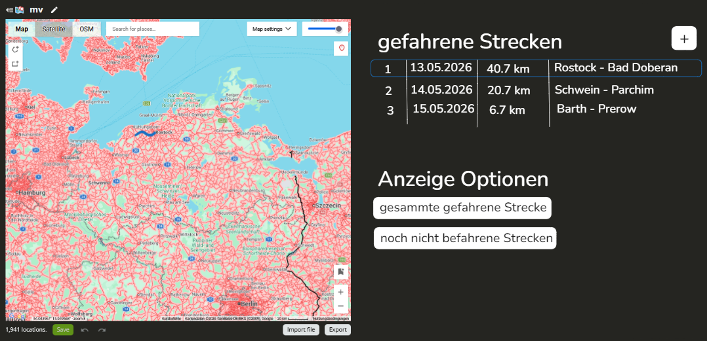

# Ziel
Ich entwickle eine Web-GIS Anwendung für den privaten Gebrauch, in einsehen kann, wo es Streetview Coverage in MV gibt und welche dieser Strecken ich schon mit dem Fahrrad abgefahren bin. 
# Use Case
1. Ich öffne die Anwendung
2. Ich sehe ein Karte von MV, auf der die Streetview Coverage von MV eingezeichnet ist.
3. Ich kann mit einem Tool Strecken einzeichnen, die ich mit dem Fahrrad gefahren bin.
4. Diese Strecke wird als Overlay angezeigt
# Erste Skizze

https://map-making.app als Inspiration
# Geplante Features
- Karte anzeigen
- Streetview anzeigen (aus- und einblenden)
- Strecke hinzufügen
- Strecken auswählen und anzeigen auf Karte (auch mehrere gleichzeitig)
# Weitere Ideen
- gesamte gefahrene Strecke anzeigen
- noch nicht befahrene Streetview anzeigen
mkdir streetview-tracker
cd streetview-tracker